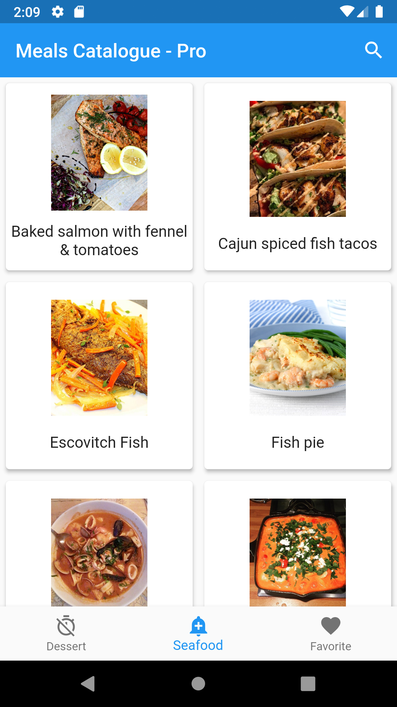
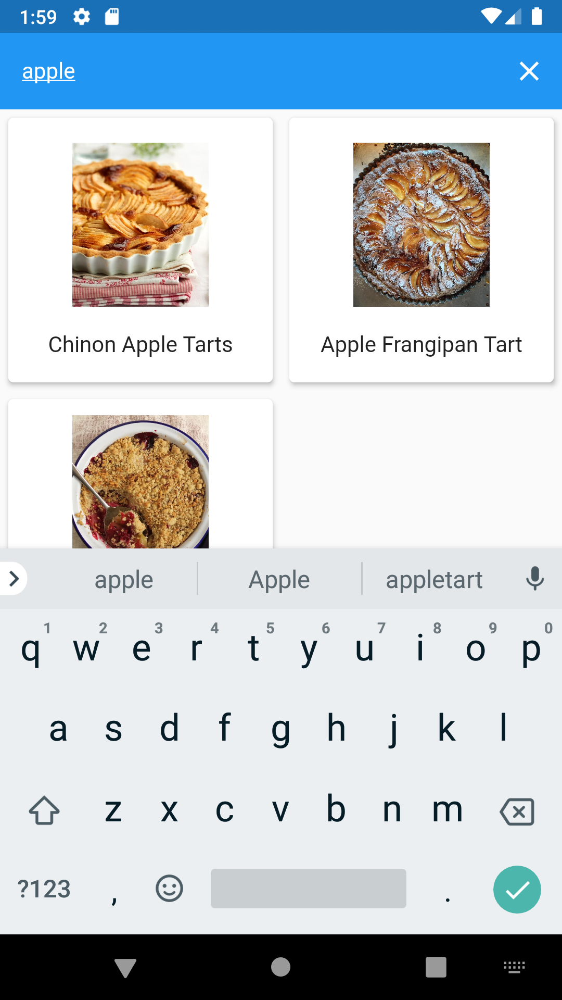
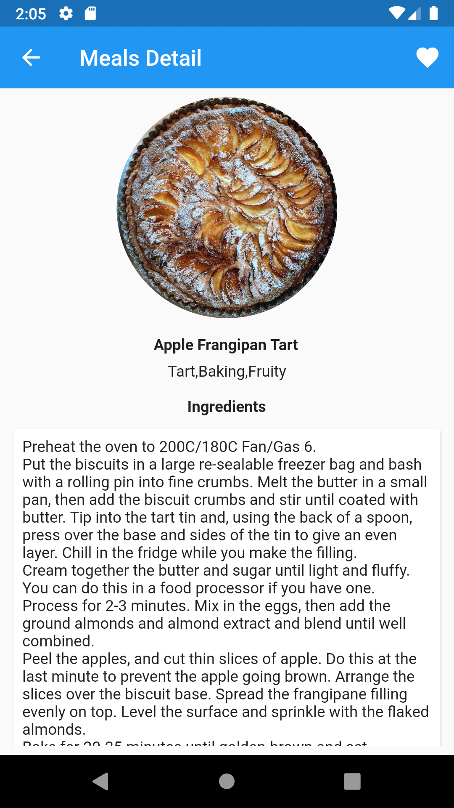
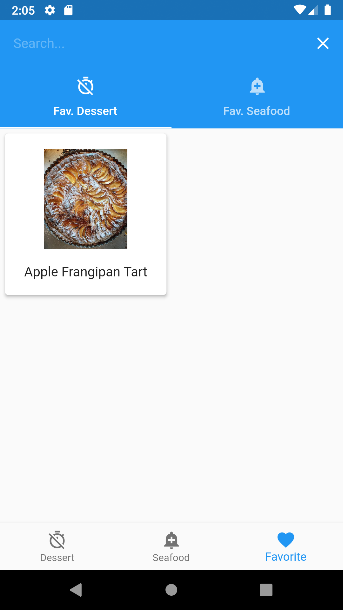

# Meals Catalogue - Dicoding Submission

Dicoding Menjadi Flutter Developer Expert

## Content

- [Submission 1](meals_catalogue_submission_1)
- [Submission 2](meals_catalogue_submission_2)
- [Submission 3](meals_catalogue_submission_3)
- [Submission final](meals_catalogue_submission_final)

## Author

goeroeku

## Requirement

- Flutter
- Android SDK & Emulator
